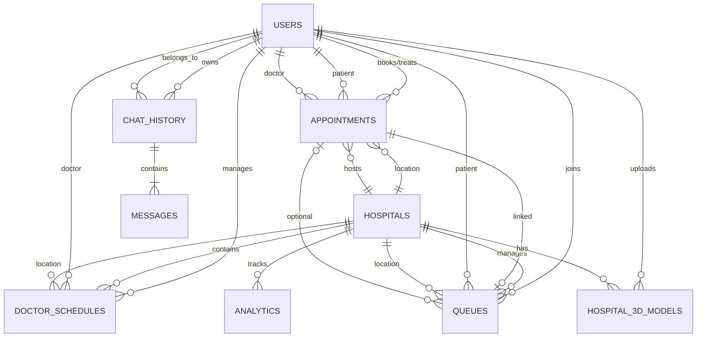

# 🗄️ Firestore Database Schema - Pulse Healthcare System

## Overview
This document defines the complete Firestore database schema for the Pulse healthcare management application.

---

## 📊 Collections Overview

| Collection | Purpose | Document Count | Key Relationships |
|------------|---------|----------------|-------------------|
| `users` | User accounts (patients, doctors, staff) | ~1000+ | → hospitals, appointments |
| `hospitals` | Hospital information & metadata | ~50-100 | → users, appointments, queues |
| `appointments` | Medical appointment bookings | ~10000+ | → users, hospitals |
| `doctor_schedules` | Doctor availability schedules | ~500+ | → users, hospitals |
| `queues` | Real-time queue management | ~100-500 | → users, hospitals, appointments |
| `hospital_3d_models` | 3D model files & metadata | ~50-100 | → hospitals, users |
| `chat_history` | AI chatbot conversations (subcollection) | ~1000+ | → users |
| `analytics` | System metrics & reporting | ~1000+ | → hospitals |

---

## 📋 Detailed Schema Tables

### 1️⃣ **users** Collection
**Path:** `users/{userId}`

| Field Name | Type | Required | Description | Enum Values |
|------------|------|----------|-------------|-------------|
| **email** | string | ✅ | User's email address | - |
| **fullName** | string | ✅ | Full name | - |
| **phoneNumber** | string | ❌ | Phone number | - |
| **userType** | string | ✅ | User role type | `patient`, `doctor`, `hospitalStaff`, `admin` |
| **profileImageUrl** | string | ❌ | Profile photo URL | - |
| **createdAt** | timestamp | ✅ | Account creation time | - |
| **lastLogin** | timestamp | ❌ | Last login timestamp | - |
| | | | **Patient-Specific Fields** | |
| **bloodType** | string | ❌ | Blood type | `A+`, `A-`, `B+`, `B-`, `AB+`, `AB-`, `O+`, `O-` |
| **dateOfBirth** | timestamp | ❌ | Date of birth | - |
| **address** | string | ❌ | Residential address | - |
| **medicalHistory** | array[string] | ❌ | Medical conditions | - |
| **emergencyContact** | string | ❌ | Emergency contact number | - |
| | | | **Doctor-Specific Fields** | |
| **specialty** | string | ❌ | Medical specialty | `Cardiology`, `Orthopedics`, etc. |
| **licenseNumber** | string | ❌ | Medical license number | - |
| **hospitalId** | string | ❌ | Primary hospital reference | FK → hospitals |
| **qualifications** | array[string] | ❌ | Degrees and certifications | - |
| **yearsOfExperience** | number | ❌ | Years of practice | - |
| | | | **Hospital Staff Fields** | |
| **staffHospitalId** | string | ❌ | Assigned hospital reference | FK → hospitals |
| **staffHospitalName** | string | ❌ | Hospital name | - |
| **department** | string | ❌ | Department | `Emergency`, `ICU`, etc. |
| **position** | string | ❌ | Job position | `Nurse`, `Admin`, etc. |
| **permissions** | array[string] | ❌ | Access permissions | - |

**Indexes:**
- Single: `email` ⬆️, `userType` ⬆️
- Composite: (`userType` ⬆️, `hospitalId` ⬆️), (`userType` ⬆️, `staffHospitalId` ⬆️)

---

### 2️⃣ **hospitals** Collection
**Path:** `hospitals/{hospitalId}`

| Field Name | Type | Required | Description | Enum Values |
|------------|------|----------|-------------|-------------|
| **name** | string | ✅ | Hospital name | - |
| **address** | string | ✅ | Full address | - |
| **latitude** | number | ✅ | GPS latitude | - |
| **longitude** | number | ✅ | GPS longitude | - |
| **phone** | string | ✅ | Contact phone | - |
| **email** | string | ✅ | Contact email | - |
| **type** | string | ✅ | Hospital type | `public`, `private`, `specialty` |
| **services** | array[string] | ✅ | Available services | `Emergency`, `ICU`, `Surgery`, etc. |
| **specialties** | array[string] | ✅ | Medical specialties | `Cardiology`, `Neurology`, etc. |
| **imageUrl** | string | ✅ | Hospital photo URL | - |
| **model3dUrl** | string | ❌ | 3D model URL (GLB/GLTF) | - |
| **model3dThumbnail** | string | ❌ | 3D model thumbnail | - |
| **status** | object | ✅ | Current status object | (see nested table below) |
| **modelMetadata** | object | ❌ | 3D model metadata | (see nested table below) |
| **staffIds** | array[string] | ❌ | Staff user IDs | FK → users |
| **createdAt** | timestamp | ❌ | Creation timestamp | - |
| **updatedAt** | timestamp | ❌ | Last update timestamp | - |

**Nested Object: `status`**
| Field | Type | Required | Description |
|-------|------|----------|-------------|
| isOpen | boolean | ✅ | Currently open |
| currentCapacity | number | ✅ | Current patient count |
| maxCapacity | number | ✅ | Maximum capacity |
| emergencyAvailable | boolean | ✅ | Emergency services status |
| averageWaitTime | number | ✅ | Wait time in minutes |

**Nested Object: `modelMetadata`**
| Field | Type | Required | Description |
|-------|------|----------|-------------|
| fileName | string | ✅ | Original file name |
| fileSize | number | ✅ | File size in bytes |
| uploadedAt | timestamp | ✅ | Upload timestamp |
| uploadedBy | string | ✅ | User ID of uploader (FK → users) |
| format | string | ✅ | File format (`glb`, `gltf`) |

**Indexes:**
- Single: `name` ⬆️, `type` ⬆️
- Composite: (`latitude` ⬆️, `longitude` ⬆️) for geo-queries

---

### 3️⃣ **appointments** Collection
**Path:** `appointments/{appointmentId}`

| Field Name | Type | Required | Description | Enum Values |
|------------|------|----------|-------------|-------------|
| **patientId** | string | ✅ | Patient user reference | FK → users |
| **patientName** | string | ✅ | Patient full name | - |
| **patientPhone** | string | ✅ | Patient phone | - |
| **patientEmail** | string | ❌ | Patient email | - |
| **doctorId** | string | ✅ | Doctor user reference | FK → users |
| **doctorName** | string | ✅ | Doctor full name | - |
| **doctorSpecialty** | string | ✅ | Doctor's specialty | - |
| **hospitalId** | string | ✅ | Hospital reference | FK → hospitals |
| **hospitalName** | string | ✅ | Hospital name | - |
| **dateTime** | timestamp | ✅ | Scheduled date/time | - |
| **durationMinutes** | number | ✅ | Appointment duration | Default: 30 |
| **type** | string | ✅ | Appointment type | `consultation`, `followUp`, `emergency`, `checkup` |
| **status** | string | ✅ | Appointment status | `pending`, `confirmed`, `cancelled`, `completed`, `noShow` |
| **chiefComplaint** | string | ❌ | Main reason for visit | - |
| **symptoms** | string | ❌ | Reported symptoms | - |
| **notes** | string | ❌ | Patient notes | - |
| **doctorNotes** | string | ❌ | Doctor's notes (post-appointment) | - |
| **prescription** | string | ❌ | Prescribed treatment | - |
| **createdAt** | timestamp | ✅ | Creation timestamp | - |
| **updatedAt** | timestamp | ❌ | Last update timestamp | - |

**Indexes:**
- Single: `patientId` ⬆️, `doctorId` ⬆️, `hospitalId` ⬆️, `status` ⬆️
- Composite: (`doctorId` ⬆️, `dateTime` ⬆️), (`patientId` ⬆️, `dateTime` ⬇️), (`hospitalId` ⬆️, `status` ⬆️, `dateTime` ⬆️)

---

### 4️⃣ **doctor_schedules** Collection
**Path:** `doctor_schedules/{scheduleId}`

| Field Name | Type | Required | Description | Enum Values |
|------------|------|----------|-------------|-------------|
| **doctorId** | string | ✅ | Doctor user reference | FK → users |
| **hospitalId** | string | ✅ | Hospital reference | FK → hospitals |
| **dayOfWeek** | number | ✅ | Day of week | 0-6 (Sunday-Saturday) |
| **startTime** | string | ✅ | Start time (24h format) | `"09:00"`, `"14:00"`, etc. |
| **endTime** | string | ✅ | End time (24h format) | `"17:00"`, `"20:00"`, etc. |
| **isAvailable** | boolean | ✅ | Accepting appointments | - |
| **maxAppointments** | number | ✅ | Max appointments per day | Default: 16 |
| **appointmentDuration** | number | ✅ | Minutes per appointment | Default: 30 |
| **createdAt** | timestamp | ❌ | Creation timestamp | - |
| **updatedAt** | timestamp | ❌ | Last update timestamp | - |

**Indexes:**
- Composite: (`doctorId` ⬆️, `dayOfWeek` ⬆️), (`hospitalId` ⬆️, `dayOfWeek` ⬆️, `isAvailable` ⬆️)

---

### 5️⃣ **queues** Collection
**Path:** `queues/{queueId}`

| Field Name | Type | Required | Description | Enum Values |
|------------|------|----------|-------------|-------------|
| **hospitalId** | string | ✅ | Hospital reference | FK → hospitals |
| **patientId** | string | ✅ | Patient user reference | FK → users |
| **patientName** | string | ✅ | Patient full name | - |
| **appointmentId** | string | ❌ | Appointment reference (if scheduled) | FK → appointments |
| **queueNumber** | number | ✅ | Queue position number | - |
| **status** | string | ✅ | Current queue status | `waiting`, `called`, `inProgress`, `completed`, `cancelled` |
| **priority** | string | ✅ | Priority level | `normal`, `urgent`, `emergency` |
| **department** | string | ✅ | Department/specialty | - |
| **estimatedWaitTime** | number | ✅ | Wait time in minutes | - |
| **checkedInAt** | timestamp | ✅ | Check-in timestamp | - |
| **calledAt** | timestamp | ❌ | Called timestamp | - |
| **completedAt** | timestamp | ❌ | Completion timestamp | - |

**Indexes:**
- Composite: (`hospitalId` ⬆️, `status` ⬆️, `checkedInAt` ⬆️), (`hospitalId` ⬆️, `department` ⬆️, `queueNumber` ⬆️)
- Single: `patientId` ⬆️

---

### 6️⃣ **hospital_3d_models** Collection
**Path:** `hospital_3d_models/{modelId}`

| Field Name | Type | Required | Description | Enum Values |
|------------|------|----------|-------------|-------------|
| **hospitalId** | string | ✅ | Hospital reference | FK → hospitals |
| **fileName** | string | ✅ | Original file name | - |
| **storageUrl** | string | ✅ | Firebase Storage URL | - |
| **thumbnailUrl** | string | ❌ | Thumbnail image URL | - |
| **fileSize** | number | ✅ | File size in bytes | - |
| **format** | string | ✅ | 3D file format | `glb`, `gltf` |
| **uploadedBy** | string | ✅ | Uploader user reference | FK → users |
| **uploadedAt** | timestamp | ✅ | Upload timestamp | - |
| **isActive** | boolean | ✅ | Currently displayed model | - |
| **metadata** | object | ❌ | Model metadata | (see nested table below) |

**Nested Object: `metadata`**
| Field | Type | Required | Description |
|-------|------|----------|-------------|
| dimensions | object | ❌ | {width, height, depth} in units |
| polyCount | number | ❌ | Polygon count |
| textureCount | number | ❌ | Number of textures |

**Indexes:**
- Composite: (`hospitalId` ⬆️, `isActive` ⬆️), (`hospitalId` ⬆️, `uploadedAt` ⬇️)

---

### 7️⃣ **chat_history** Collection (Subcollection)
**Path:** `users/{userId}/chat_history/{chatId}`

| Field Name | Type | Required | Description |
|------------|------|----------|-------------|
| **sessionId** | string | ✅ | Unique session identifier |
| **startedAt** | timestamp | ✅ | Session start time |
| **lastMessageAt** | timestamp | ✅ | Last message timestamp |
| **messageCount** | number | ✅ | Total messages in session |

**Subcollection: `messages`**
**Path:** `users/{userId}/chat_history/{chatId}/messages/{messageId}`

| Field Name | Type | Required | Description | Enum Values |
|------------|------|----------|-------------|-------------|
| **role** | string | ✅ | Message sender | `user`, `assistant` |
| **content** | string | ✅ | Message text | - |
| **timestamp** | timestamp | ✅ | Message timestamp | - |
| **contextType** | string | ❌ | Context category | `hospital`, `appointment`, `general` |
| **metadata** | object | ❌ | Additional context data | - |

**Indexes:**
- Parent: `lastMessageAt` ⬇️
- Subcollection: `timestamp` ⬆️

---

### 8️⃣ **analytics** Collection (Optional)
**Path:** `analytics/{analyticsId}`

| Field Name | Type | Required | Description |
|------------|------|----------|-------------|
| **hospitalId** | string | ❌ | Hospital reference (if hospital-specific) |
| **type** | string | ✅ | Analytics type (`appointment`, `queue`, `capacity`, `staff`) |
| **date** | timestamp | ✅ | Date of the record |
| **appointmentStats** | object | ❌ | Appointment statistics |
| **queueStats** | object | ❌ | Queue statistics |
| **capacityStats** | object | ❌ | Capacity statistics |

---

## 🔗 Database Relationships (ERD)



---

## 📊 Relationship Matrix

| Collection | References → | Referenced By ← |
|------------|-------------|-----------------|
| **users** | hospitals (doctorId → hospitalId) | appointments (patientId, doctorId)<br>doctor_schedules (doctorId)<br>queues (patientId)<br>hospital_3d_models (uploadedBy) |
| **hospitals** | - | appointments (hospitalId)<br>doctor_schedules (hospitalId)<br>queues (hospitalId)<br>hospital_3d_models (hospitalId)<br>users (hospitalId, staffHospitalId) |
| **appointments** | users (patientId, doctorId)<br>hospitals (hospitalId) | queues (appointmentId) |
| **doctor_schedules** | users (doctorId)<br>hospitals (hospitalId) | - |
| **queues** | users (patientId)<br>hospitals (hospitalId)<br>appointments (appointmentId) | - |
| **hospital_3d_models** | hospitals (hospitalId)<br>users (uploadedBy) | - |
| **chat_history** | users (parent collection) | messages (subcollection) |
| **analytics** | hospitals (hospitalId) | - |

---

## 🔐 Security Rules Summary

| Collection | Read | Write | Notes |
|------------|------|-------|-------|
| **users** | Own data + Admins | Own data + Admins | Users can only access their own profile |
| **hospitals** | Public | Staff + Admins | Anyone can view hospitals |
| **appointments** | Patient + Doctor + Staff | Patient + Doctor + Staff | Only involved parties can access |
| **doctor_schedules** | Public | Doctor + Admins | Anyone can view schedules |
| **queues** | Patient + Staff | Staff only | Patients see their own queue entry |
| **hospital_3d_models** | Public | Staff + Admins | Anyone can view models |
| **chat_history** | Owner only | Owner only | Private conversations |
| **analytics** | Admins only | System only | Internal metrics |

---

## 📈 Cardinality & Relationships

### One-to-Many Relationships

| Parent (One) | Child (Many) | Foreign Key | Relationship Type |
|--------------|--------------|-------------|-------------------|
| users (doctor) | appointments | doctorId | 1:N |
| users (patient) | appointments | patientId | 1:N |
| users (doctor) | doctor_schedules | doctorId | 1:N |
| users (patient) | queues | patientId | 1:N |
| users | chat_history | userId (path) | 1:N (subcollection) |
| hospitals | appointments | hospitalId | 1:N |
| hospitals | doctor_schedules | hospitalId | 1:N |
| hospitals | queues | hospitalId | 1:N |
| hospitals | hospital_3d_models | hospitalId | 1:N |
| chat_history | messages | chatId (path) | 1:N (subcollection) |

### Many-to-One Relationships

| Child (Many) | Parent (One) | Join Key | Description |
|--------------|--------------|----------|-------------|
| appointments | users (patient) | patientId | Patient books appointment |
| appointments | users (doctor) | doctorId | Doctor assigned to appointment |
| appointments | hospitals | hospitalId | Appointment at hospital |
| queues | appointments | appointmentId | Queue linked to appointment (optional) |
| doctor_schedules | users (doctor) | doctorId | Schedule belongs to doctor |
| doctor_schedules | hospitals | hospitalId | Schedule at hospital |

### Many-to-Many (Through Collections)

| Entity A | Entity B | Through Collection | Description |
|----------|----------|-------------------|-------------|
| users (patients) | users (doctors) | appointments | Patients see multiple doctors |
| users (doctors) | hospitals | doctor_schedules | Doctors work at multiple hospitals |
| hospitals | users (staff) | users.staffIds | Hospitals employ multiple staff |

---

## 🔍 Common Query Patterns

### Query 1: Get Doctor's Today Appointments
```dart
final today = DateTime.now();
final startOfDay = DateTime(today.year, today.month, today.day);
final endOfDay = startOfDay.add(Duration(days: 1));

FirebaseFirestore.instance
  .collection('appointments')
  .where('doctorId', isEqualTo: doctorId)
  .where('dateTime', isGreaterThanOrEqualTo: startOfDay)
  .where('dateTime', isLessThan: endOfDay)
  .where('status', whereIn: ['pending', 'confirmed'])
  .orderBy('dateTime')
  .get();
```

### Query 2: Get Hospital Queue by Department
```dart
FirebaseFirestore.instance
  .collection('queues')
  .where('hospitalId', isEqualTo: hospitalId)
  .where('department', isEqualTo: 'Emergency')
  .where('status', isEqualTo: 'waiting')
  .orderBy('priority', descending: true)  // Emergency first
  .orderBy('queueNumber')
  .snapshots();
```

### Query 3: Get Available Doctors for Specialty
```dart
FirebaseFirestore.instance
  .collection('users')
  .where('userType', isEqualTo: 'doctor')
  .where('specialty', isEqualTo: 'Cardiology')
  .where('hospitalId', isEqualTo: hospitalId)
  .get();
```

### Query 4: Get Patient's Medical History
```dart
FirebaseFirestore.instance
  .collection('appointments')
  .where('patientId', isEqualTo: userId)
  .where('status', isEqualTo: 'completed')
  .orderBy('dateTime', descending: true)
  .limit(10)
  .get();
```

### Query 5: Get Doctor's Weekly Schedule
```dart
FirebaseFirestore.instance
  .collection('doctor_schedules')
  .where('doctorId', isEqualTo: doctorId)
  .where('isAvailable', isEqualTo: true)
  .orderBy('dayOfWeek')
  .get();
```

### Query 6: Get Nearby Hospitals (Geo-query)
```dart
// Using geoflutterfire package
final center = GeoFirePoint(latitude, longitude);
final collectionRef = FirebaseFirestore.instance.collection('hospitals');

geoflutterfire
  .collection(collectionRef: collectionRef)
  .within(
    center: center,
    radius: 10, // 10 km radius
    field: 'position', // GeoFirePoint field
    strictMode: true,
  );
```

---

## 🛠️ Migration & Setup

### Step 1: Initialize Collections
Run the seed script to populate initial data:
```dart
// In your Flutter app
await FirebaseSeeder.seedHospitals();
await FirebaseSeeder.seedSampleUsers();
```

### Step 2: Create Composite Indexes
Go to Firebase Console → Firestore → Indexes → Add Index:

| Collection | Fields | Order |
|------------|--------|-------|
| appointments | doctorId ⬆️, dateTime ⬆️ | |
| appointments | patientId ⬆️, dateTime ⬇️ | |
| appointments | hospitalId ⬆️, status ⬆️, dateTime ⬆️ | |
| doctor_schedules | doctorId ⬆️, dayOfWeek ⬆️ | |
| queues | hospitalId ⬆️, status ⬆️, checkedInAt ⬆️ | |
| queues | hospitalId ⬆️, department ⬆️, queueNumber ⬆️ | |
| hospital_3d_models | hospitalId ⬆️, isActive ⬆️ | |

### Step 3: Update Firestore Rules
```javascript
rules_version = '2';
service cloud.firestore {
  match /databases/{database}/documents {
    // Helper functions
    function isAuthenticated() {
      return request.auth != null;
    }
    
    function isOwner(userId) {
      return isAuthenticated() && request.auth.uid == userId;
    }
    
    function isAdmin() {
      return isAuthenticated() && 
        get(/databases/$(database)/documents/users/$(request.auth.uid)).data.userType == 'admin';
    }
    
    // Users collection
    match /users/{userId} {
      allow read: if isOwner(userId) || isAdmin();
      allow write: if isOwner(userId) || isAdmin();
    }
    
    // Hospitals collection
    match /hospitals/{hospitalId} {
      allow read: if true;  // Public read
      allow write: if isAdmin();
    }
    
    // Appointments collection
    match /appointments/{appointmentId} {
      allow read: if isAuthenticated() && (
        resource.data.patientId == request.auth.uid ||
        resource.data.doctorId == request.auth.uid ||
        isAdmin()
      );
      allow create: if isAuthenticated();
      allow update, delete: if isAuthenticated() && (
        resource.data.patientId == request.auth.uid ||
        isAdmin()
      );
    }
    
    // Doctor schedules
    match /doctor_schedules/{scheduleId} {
      allow read: if true;  // Public read
      allow write: if isAuthenticated() && (
        request.resource.data.doctorId == request.auth.uid ||
        isAdmin()
      );
    }
    
    // Queues
    match /queues/{queueId} {
      allow read: if isAuthenticated();
      allow write: if isAdmin();  // Only staff/admin can modify
    }
    
    // Chat history (subcollection)
    match /users/{userId}/chat_history/{chatId} {
      allow read, write: if isOwner(userId);
      
      match /messages/{messageId} {
        allow read, write: if isOwner(userId);
      }
    }
  }
}
```

---

## 📊 Data Validation Rules

| Field Type | Validation | Example |
|------------|------------|---------|
| Email | Valid email format | `user@example.com` |
| Phone | 10-15 digits | `+639123456789` |
| DateTime | ISO 8601 format | `2025-12-06T10:30:00Z` |
| Enum | Must match predefined values | `userType: "patient"` |
| Array | Max 50 items | `services: [...]` |
| String | Max 500 characters (default) | `notes: "..."` |
| GeoPoint | Valid lat/lng | `lat: 14.5995, lng: 120.9842` |

---

## 🎯 Best Practices

### Performance Optimization
1. ✅ **Use composite indexes** for multi-field queries
2. ✅ **Paginate large result sets** (limit 50-100 items)
3. ✅ **Denormalize data** for faster reads (e.g., store doctorName in appointments)
4. ✅ **Use subcollections** for 1:N relationships with many children (chat messages)
5. ✅ **Implement field-level security** in Firestore rules

### Data Consistency
1. ✅ **Use transactions** for multi-document updates (appointments + queues)
2. ✅ **Use batch writes** for bulk operations (< 500 docs)
3. ✅ **Set timestamps** with `FieldValue.serverTimestamp()`
4. ✅ **Validate enum values** before writing
5. ✅ **Handle offline mode** with local cache

### Cost Management
1. ✅ **Minimize document reads** (cache frequently accessed data)
2. ✅ **Use `snapshots()` wisely** (real-time listeners increase costs)
3. ✅ **Cleanup old data** (archive completed appointments after 6 months)
4. ✅ **Monitor query patterns** in Firebase Console
5. ✅ **Use Cloud Functions** for scheduled cleanup tasks

---

## 📝 Sample Data Structure

### Example User Document (Doctor)
```json
{
  "email": "dr.smith@hospital.com",
  "fullName": "Dr. John Smith",
  "phoneNumber": "+639171234567",
  "userType": "doctor",
  "profileImageUrl": "https://storage.googleapis.com/...",
  "specialty": "Cardiology",
  "licenseNumber": "MD-12345",
  "hospitalId": "hosp_001",
  "qualifications": ["MD", "FACC", "Board Certified Cardiologist"],
  "yearsOfExperience": 15,
  "createdAt": "2024-01-15T08:00:00Z",
  "lastLogin": "2025-12-06T09:30:00Z"
}
```

### Example Appointment Document
```json
{
  "patientId": "user_123",
  "patientName": "Jane Doe",
  "patientPhone": "+639181234567",
  "doctorId": "user_456",
  "doctorName": "Dr. John Smith",
  "doctorSpecialty": "Cardiology",
  "hospitalId": "hosp_001",
  "hospitalName": "Manila General Hospital",
  "dateTime": "2025-12-10T14:00:00Z",
  "durationMinutes": 30,
  "type": "consultation",
  "status": "confirmed",
  "chiefComplaint": "Chest pain and shortness of breath",
  "symptoms": "Pain radiating to left arm, mild dyspnea",
  "notes": "Patient prefers afternoon appointments",
  "createdAt": "2025-12-06T10:00:00Z"
}
```

---

**Document Version:** 1.0  
**Last Updated:** December 6, 2025  
**Schema Revision:** Initial Release
